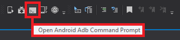

# Android Debug Bridge (adb)
## Reference
[https://developer.android.com/studio/command-line/adb](https://developer.android.com/studio/command-line/adb)



## Test App Launch
```
adb shell am start -a android.intent.action.VIEW -c android.intent.category.BROWSABLE -d "myschema://myhost?params=helloworld"
```

## Android: Intent
```
[IntentFilter(new[] { Android.Content.Intent.ActionView },
        DataScheme = "myschema",
        DataHost = "myhost",
        Categories = new[] {
            Android.Content.Intent.CategoryDefault,
            Android.Content.Intent.CategoryBrowsable,
            Android.Content.Intent.CategoryAppBrowser})]
public class MainActivity : global::Xamarin.Forms.Platform.Android.FormsAppCompatActivity
{
	protected override void OnCreate(Bundle bundle)
	{
		// App initialization

		var action = Intent?.Action;
		var data = Intent?.Data;

		LoadApplication(new App());
	}
}
```
